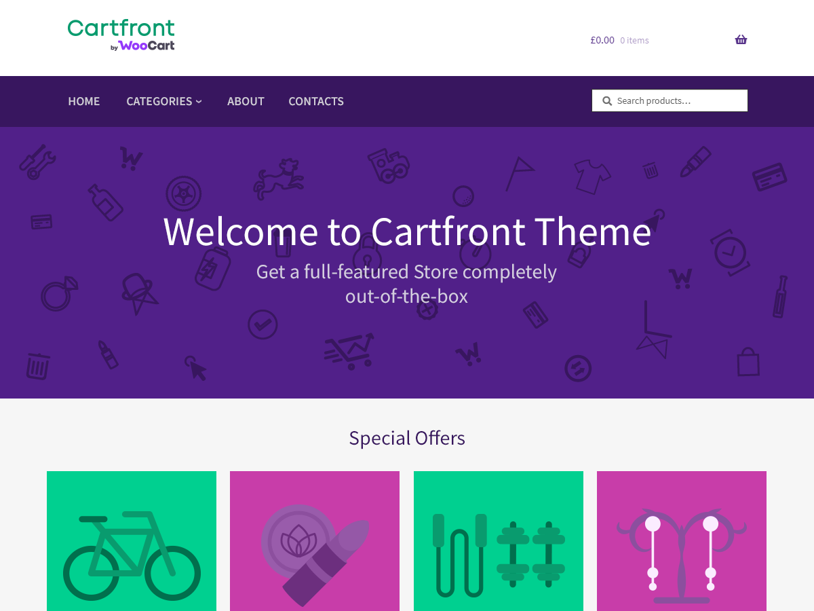

# Cartfront WordPress Theme

## Introduction

**Cartfront** is a Child Theme for Storefront and is developed by [**WooCart**](https://woocart.com). It adds useful add-ons on top of the storefront theme and brings more options for better customization of your WooStore.

## Add-ons

Below is the list of add-ons added to the **Cartfront** theme.

* [Footer Bar](/docs/1_Features/footer-bar.md)
* [Hamburger Menu](/docs/1_Features/hamburger-menu.md)
* [Slider](/docs/1_Features/slider.md)
* [Homepage Control](/docs/1_Features/homepage-control.md)
* [Link Boxes](/docs/1_Features/link-boxes.md)
* [Blog Customizer](/docs/1_Features/blog-customizer.md)
* [Menu Colors](/docs/1_Features/menu-colors.md)

In addition to the above add-ons, **Cartfront** also comes power packed with [**Cartfront Presets**](/docs/1_Features/cartfront-presets.md) which provides a quick switch between various **Layouts** and **Color Schemes**.
